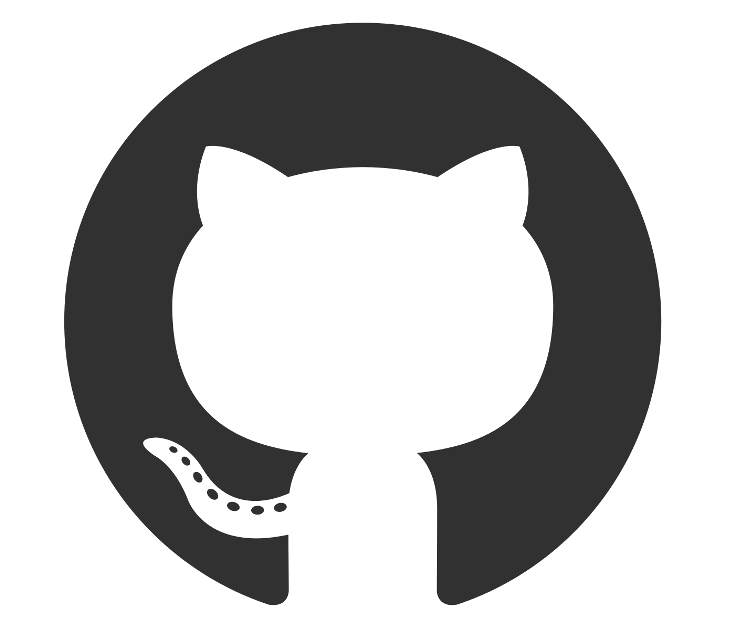

### Hi, I'm Firza

## I'm a New Developer:

    for the past few months I have learned, understand, and practice front end tools, such as HTML, CSS, Javscript, React, erc. I am confident that i can contribute as a Junior Front End Developer, and learn so much more!.

- I am currently looking for a job as a Junior Front End Developer.
- I'm currently trying to build some small projects, and hopefully big ones in the near future.
- My goals by the end of 2020 is to be more proficient in using front end tools, and I hope to reach it by getting a job.
- I desire more knowledge and experience in other things, such as: Node JS, UI/UX

### Languages and Tools:

[]
[]
[]
[]
[]
[]
[]
[]
[]
[]
[]
[]

## Some of My Projects:

- [Personal Website] | [View repo](https://github.com/firzatullahd/firzatullahd.github.io)
- [Vidly] | [View repo](https://github.com/firzatullahd/vidly)
- [Staycation] | [View repo](https://github.com/firzatullahd/staycation)
- [Recipe-App] | [View repo](https://github.com/firzatullahd/recipe-app)
- [Movie DB] | [View repo](https://github.com/firzatullahd/implement-moviedb-api)
- [Responsive Website] | [View repo](https://github.com/firzatullahd/responsive-web)
- [Bootstrap Website] | [View repo](https://github.com/firzatullahd/bootstrap)
- [Fake Pizza Hut Website] | [View repo](https://github.com/firzatullahd/wpu-hut)

[personal website]: https://firzatullahd.github.io
[bootstrap website]: https://firzatullahd.github.io/bootstrap
[vidly]: https://firzatullahd-vidly.herokuapp.com/
[staycation]: https://firzatullahd-staycation.herokuapp.com/
[recipe-app]: https://firzatullahd-recipe-app.herokuapp.com/
[responsive website]: https://firzatullahd.github.io/responsive-web
[movie db]: https://firzatullahd.github.io/implement-moviedb-api
[fake pizza hut website]: https://firzatullahd.github.io/wpu-hut
